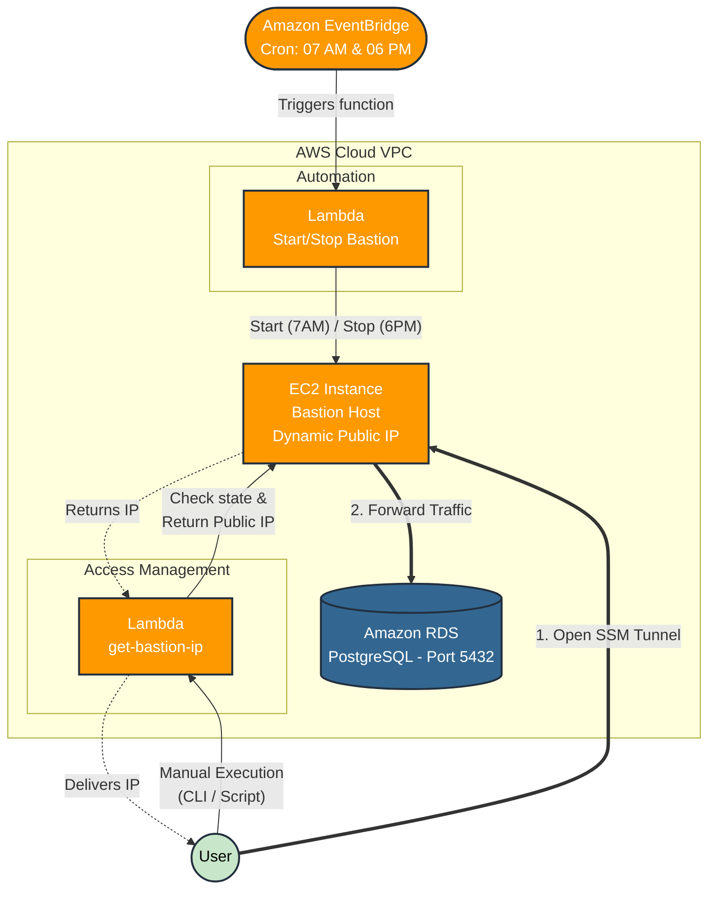

# Lambda Functions




Functions:

1. Scheduling start and stop instance.
2. Get IPv4 address of instances.


# Function: scheduling instance start/stop times

**Objective**: Leave instance enabled only during business hours.

* Function in the `lambda/bastion-scheduling` directory.


### Test local

The field `instance_id` of `echo` command, replace INSTANCE_ID from `template.yaml` file.

```bash
# start EC2 instance
echo '{"action":"start", "instance_id":"i-05e6517e24b3a78d7"}' | sam local invoke BastionSchedulerFunction  --event -

# stop EC2 instance
echo '{"action":"stop", "instance_id":"i-05e6517e24b3a78d7"}' | sam local invoke BastionSchedulerFunction  --event -
```

For fix instance ID, replace `INSTANCE_ID` in `template.yaml` file.


# Function: get IPv4 address of instances

**Objective**: To provide only public IPv4 addresses, not allowing EC2:DescribeInstance or the use of Elastic IP resource.

Developers who need the instance's public IPv4 address to connect. This lambda function only returns the IPv4 address (get), and does not allow any other execution. This is to avoid using Elastic IP or releasing the full listing of instances -- zero trust principle.


Created new profile `lambda_user` with policy attached:

```
{
    "Version": "2012-10-17",
    "Statement": [
        {
            "Sid": "GetPublicIPInstance",
            "Effect": "Allow",
            "Action": "lambda:InvokeFunction",
            "Resource": "arn:aws:lambda:us-east-1:117911340068:function:bastion-ip-public-*"
        }
    ]
}
```

Function in the `lambda/bastion-get_ipv4_public/` directory.


### Test local

See `scripts/bastion-get_ip.sh`


# Lambda -- build, deploy and delete

### Build and Deploy

```bash
# first running
sam build
sam deploy --guided #--profile default

# next runnings
sam build && \
sam deploy #--profile default
```


### Remove function of Lambda

```bash
sam delete #--profile default
```
